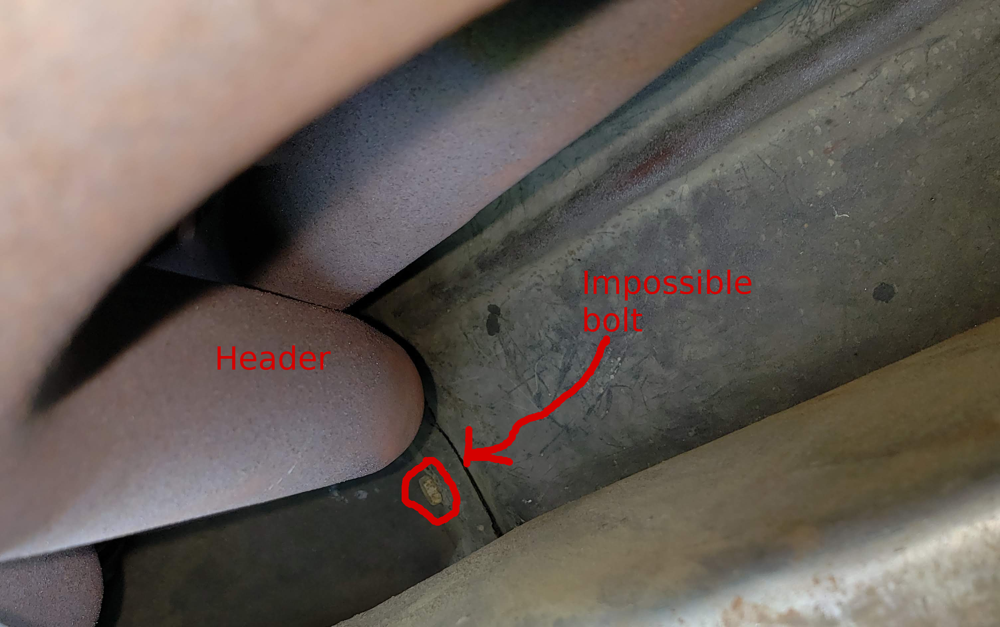
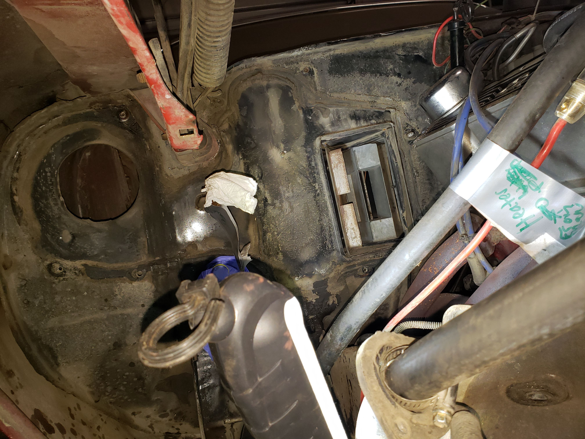
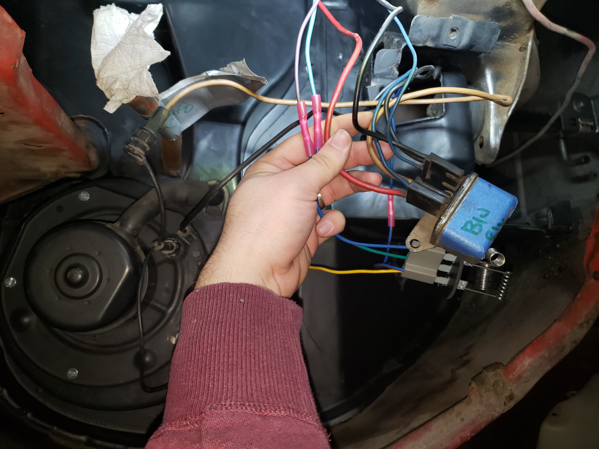
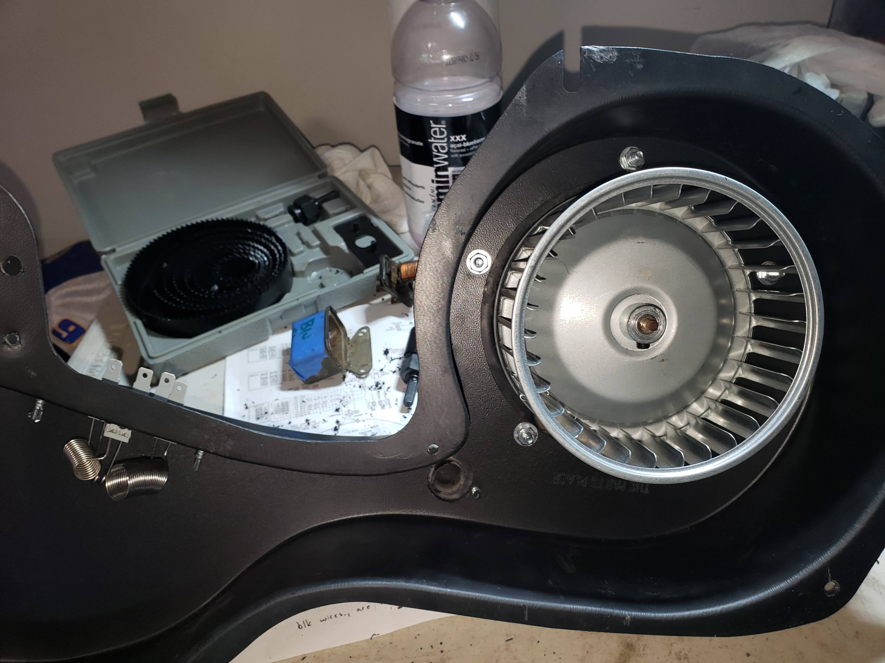
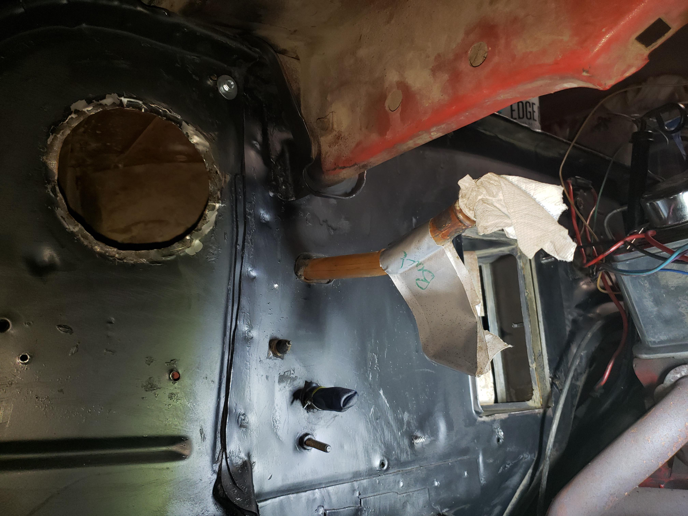
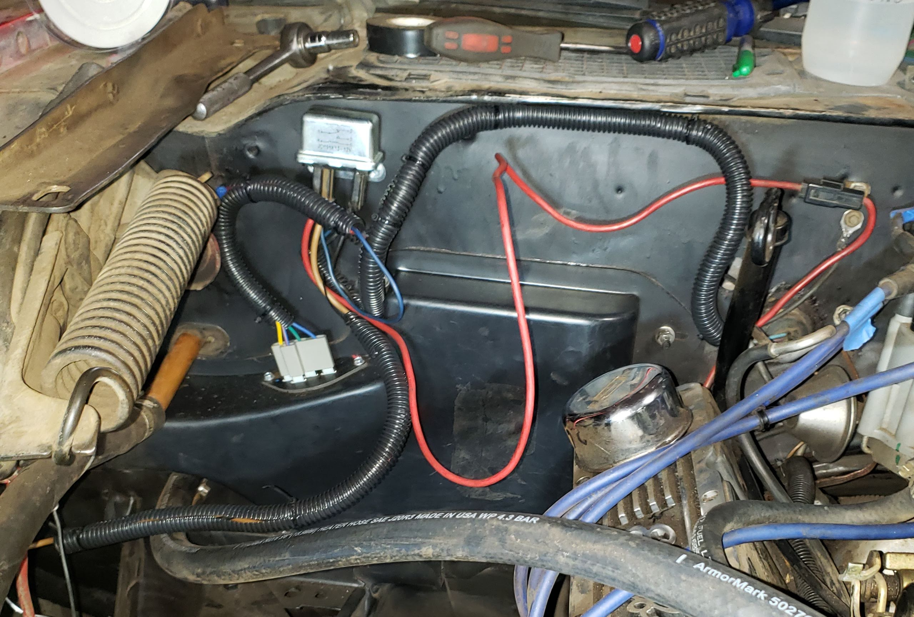

# Air Conditioning Delete for 1977 Camaro LT

This tutorial provides an overview for individuals removing the stock air-conditioning system in their 2nd generation GM F-Body cars.

## Parts Required (Total = $183.11)

* [ ] AC Delete Cover (I did the Classic Industries 70-81 ABS AC Delete Cover - #14963 - https://www.classicindustries.com/product/all-years/chevrolet/camaro/parts/14963.html : $139.99)
    * This doesn't fit all that well on my firewall, I had to do some work to shoehorn it in. Specifically, pounding in the raised part of the firewall so that the fan would clear.
* [ ] Blower Motor Cage for Cars without AC (Classic Industries - #19953 - https://www.classicindustries.com/product/all-years/chevrolet/camaro/parts/19953.html : $19.99)
* [ ] Blower Motor Resistor (I got Dorman 973-430 Blower Motor Resistor kit - https://www.amazon.com/gp/product/B00FOOUVTW/ref=ppx_yo_dt_b_asin_title_o04_s00?ie=UTF8&psc=1 : $11.04)
* [ ] Blower Fan High relay (I got Four Seasons 35767 Relay - https://www.amazon.com/gp/product/B000C2QN9S/ref=ppx_yo_dt_b_asin_title_o03_s00?ie=UTF8&psc=1 : $12.09)
* [ ] Wire loom wrap

## Tools Required (as I recall)

* [ ] Sockets (not deep) [1/4, 3/8, 5/16]
* [ ] Knife (for cutting water hoses)
* [ ] Bucket (for collecting coolant)
* [ ] End wrenches matching sockets
* [ ] Wiring pliers
* [ ] Electrical testing indicator light
* [ ] Drill with 1 3/4" bit and 1" bit (although, could have gone just a bit smaller on the 1")

## Tear Down

1. Disconnect current electrical terminals to resistor, relay, and all corresponding connectors.

1. Disconnect and mark both water lines to heater (mark upper and lower).
    * These were difficult to remove and should be cut from the heater core to avoid damaging the sauter of the piping to the core.
2. Remove heater fan.
    * Electrical connections (ground and power) and the interference sink (big metal cylinder).
    * Clean air hose should be unscrewed from current AC suitcase.
    * Small bolts around fan.
3. Remove bolts holding suitcase together (it has to be removed in 2 parts to fit).
    * 2xTop, 2xSide, 2xBottom (these are nearly impossible to access on the bottom with headers installed).
    * I ended up disconnecting top and side and then breaking bottom.
4. Remove bolts holding cover in place.
    * One at the bottom, near the headers is nearly unreachable. With a lot of patience, used a 3/8 end wrench from underneath.
    * One in top left of the box, above the heater fan (to the top right) is hard to see.

## Rebuild and Reinstall

1. Test Wires and cap unnecessary wires, see table 1.
    * I capped off the green wire, and was already using the tan (power) wire out of the firewall for the choke. I split that off to also run the cowl switch.
    * I left the yellow (low) on the new resistor disconnected to avoid the constant power state. This would have been the green wire.
    * Remember to connect ground to ground wire that will connect to blower motor.

2. Install resistor in cover.
    * Drill 1 3/4" hole.
    * Drill 1" hole after marking location for fresh air into blower fan (a rubber hose).

3. Install blower motor in box.
    * I got new bolts because I felt like the self-tapping screws would not be adequate in the non-metal frame of the box.
4. Mock up and check clearances
    * Had to flatten the hole in the firewall where the fan goes (clipped the lip inward and then hammered pieces in)
    * Added self-tapping holes and cut out pre-drilled holes in the box that didn't line up perfectly. The studs coming out of the firewall mostly did not align or could not hold nuts.
        * Top right above the blower fan had a very large washer on it, and then I started it before putting the box on. That way I could just slide the delete box into place (it has a groove not a hole).

5. Put a pretty hefty bead of silicone around lip of Delete Box and install.

Table 1 - Wiring Diagram

| Path                              | Purpose               |
|-----------------------------------|-----------------------|
| Ign -> Tan -> AC Compressor       | Switches on low fan when AC is on (not needed) |
| Ign -> Green -> Resistor-Low      | Low fan switchh       |
| Ign -> Purple -> Resistor-Medium  | Low-Med fan switch    |
| Ign -> Light Blue -> Resistor-High| Med-High fan switch   |
| Ign -> Blue - Relay               | High fan switch (bypasses resistor)       |
| Resistor-Out -> Blue w/ Stripe -> Relay | Switch on power in Low:Med-High |
| Relay -> Black -> Firewall        | Negative ground (not present in all builds)   |
| Relay -> Black -> Blower Fan Ground | Negative ground for motor |
| Relay -> Tan -> Blower Fan Hot    | Passes power to blower motor |
